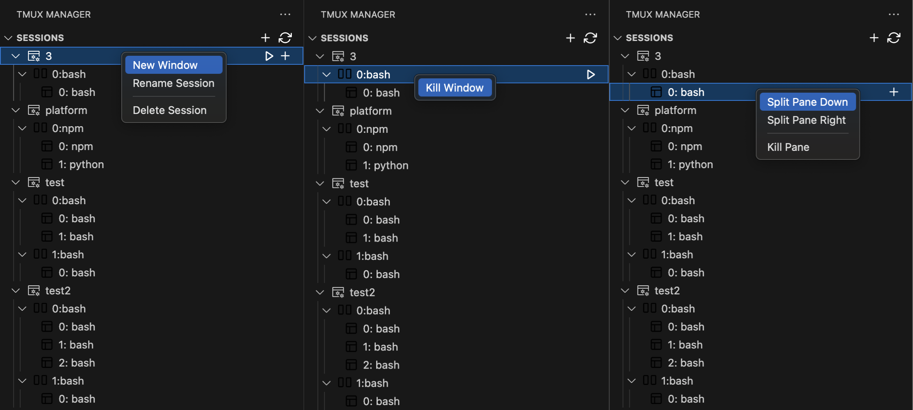

# Tmux Session Manager for VS Code

English | [简体中文](./README_zh.md)

[](https://marketplace.visualstudio.com/items?itemName=ZeroRegister.vscode-tmux-manager)

[](https://opensource.org/licenses/MIT)

Easily manage your Tmux sessions, windows, and panes in the VS Code sidebar.



## ✨ Features

-   **🌲 Tree View**: Displays all Tmux elements in a clear tree structure: Session -> Window -> Pane.
-   **🖱️ One-Click Actions**:
    -   **Quick Attach**: Click the launch icon (▶) next to any session, window, or pane to attach it in the VS Code integrated terminal.
    -   **Smart Terminal Reuse**: Automatically reuses open terminals to avoid clutter.
-   **⚡ Efficient Management**:
    -   **Sessions**: Create, rename, and delete.
    -   **Windows**: Quickly create new windows via inline icons or the context menu.
    -   **Panes**: Split panes horizontally/vertically or close them using inline icons or the context menu.
-   **Intuitive UI**:
    -   **Inline Icons**: Hover over any item to see common action icons for direct operations.
    -   **Context Menu**: A full context menu provides access to all management features.

## 🚀 Installation

### Method 1: From the VS Code Marketplace (Recommended)

1.  Open VS Code.
2.  Go to the Extensions view (`Ctrl+Shift+X`).
3.  Search for `vscode-tmux-manager`.
4.  Click **Install**.

### Method 2: Manual Installation from a `.vsix` file

1.  Download the latest `.vsix` file from the [Releases page](https://github.com/ZeroRegister/vscode-tmux-manager/releases).
2.  In VS Code, open the Extensions view.
3.  Click the `...` (More Actions) button at the top of the view.
4.  Select **Install from VSIX...**.
5.  Choose the `.vsix` file you downloaded to install.

## 📖 Usage

1.  **Open the View**: Click the **Tmux icon** in the VS Code Activity Bar on the left to see all your running Tmux sessions.
2.  **Refresh**: Click the refresh button in the view's title bar to manually sync the Tmux state.

### Session Actions
-   **Attach**: Click the **▶** icon to the right of the session item.
-   **New Window**: Click the **+** icon to the right of the session item, or right-click and select "New Window".
-   **Rename**: Right-click the session and select "Rename Session".
-   **Delete**: Right-click the session and select "Delete Session".

### Window Actions
-   **Attach**: Click the **▶** icon to the right of the window item to switch to that window.
-   **Close**: Right-click the window and select "Kill Window".

### Pane Actions
-   **Attach**: Click the **▶** icon to the right of the pane item to switch to that pane.
-   **Split Pane**: Click the **+** icon to the right of the pane item and choose a split direction (right or down). You can also use the context menu.
-   **Close**: Right-click the pane and select "Kill Pane".

## 🎒 Packaging the Extension
```shell
npm install -g vsce
vsce package
```

## 📋 Requirements

-   **`tmux`** must be installed on your system.

## 📄 License

This project is licensed under the [MIT](https://opensource.org/licenses/MIT) License.